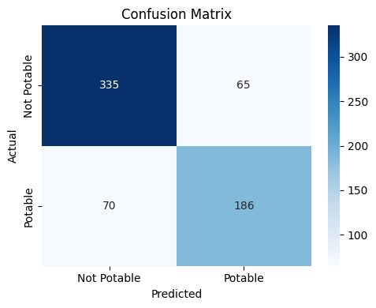
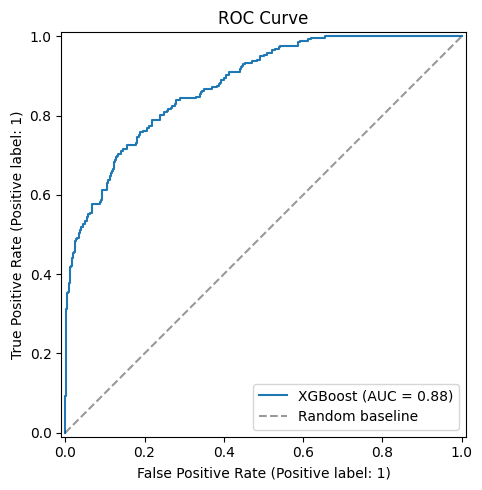
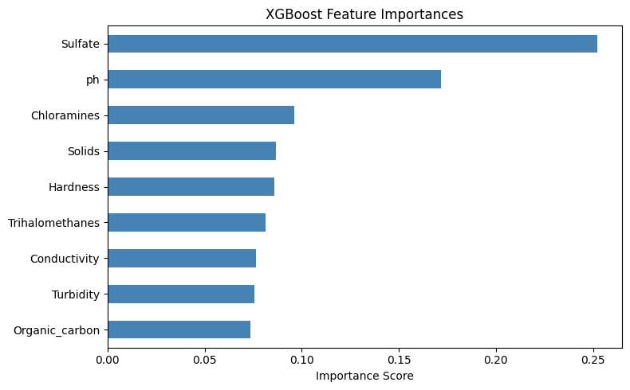

# 💧 Water Potability Prediction — XGBoost Classifier

Predicting whether water is safe for human consumption using machine learning.

---

## 📌 Problem Statement

Access to safe drinking water is a global public health challenge. This project uses water quality measurements to predict whether a given water sample is **potable (safe to drink)** or **not potable**, using an XGBoost classification model.

---

## 📂 Dataset

- **Source:** [Kaggle — Water Potability Dataset](https://www.kaggle.com/datasets/adityakadiwal/water-potability)
- **Size:** 3,276 water samples
- **Target column:** `Potability` (1 = Safe, 0 = Not Safe)
- **Features used:**

| Feature | Description |
|---|---|
| pH | Acidity / alkalinity of water |
| Hardness | Calcium and magnesium content |
| Solids | Total dissolved solids (ppm) |
| Chloramines | Amount of chloramines (ppm) |
| Sulfate | Sulfate concentration (mg/L) |
| Conductivity | Electrical conductivity (μS/cm) |
| Organic Carbon | Total organic carbon (ppm) |
| Trihalomethanes | Concentration of THMs (μg/L) |
| Turbidity | Cloudiness of water (NTU) |

---

## 🔧 Approach

1. **Exploratory Data Analysis (EDA)** — KDE plots per feature, correlation heatmap
2. **Preprocessing** — Class-stratified median imputation for missing values (pH, Sulfate, Trihalomethanes)
3. **Train/Test Split** — 80/20 stratified split to preserve class balance
4. **Scaling** — StandardScaler applied after split (no data leakage)
5. **Class Imbalance** — SMOTE applied on training set only
6. **Modelling** — XGBoost with best hyperparameters from GridSearchCV
7. **Threshold Tuning** — Optimal decision threshold selected by maximising F1 score
8. **Feature Importance** — Visualised using XGBoost's built-in importance scores

---

## 📈 Results

| Metric | Score |
|---|---|
| Accuracy | 0.7942 |
| Precision | 0.7410 |
| Recall | 0.7266 |
| F1 Score | 0.7337 |
| ROC-AUC | **0.8769** |

> Best hyperparameters: `n_estimators=400`, `max_depth=8`, `learning_rate=0.05`, `subsample=0.8`

### Confusion Matrix


### ROC Curve


### Feature Importance

---

## 🚀 How to Run

1. Clone this repository:
```bash
git clone https://github.com/Parv0108/water-potability.git
cd water-potability
```

2. Install required packages:
```bash
pip install -r requirements.txt
```

3. Open the notebook:
```bash
jupyter notebook notebooks/water_potability_xgboost_final.ipynb
```

4. Make sure `water_potability.csv` (from Kaggle) is in the same folder as the notebook before running.

---

## 📦 Saved Model

The trained model, scaler, and optimal threshold are saved together as `water_potability_xgb.pkl` using `joblib`. This file can be loaded directly to make predictions without retraining.

```python
import joblib
bundle = joblib.load('water_potability_xgb.pkl')
model     = bundle['model']
scaler    = bundle['scaler']
threshold = bundle['threshold']
```

---

## 🛠 Tech Stack

- Python 3
- Pandas, NumPy
- Matplotlib, Seaborn
- Scikit-learn
- imbalanced-learn (SMOTE)
- XGBoost
- Joblib

---

## 👤 Author

Made by [Parv](https://github.com/Parv0108)
